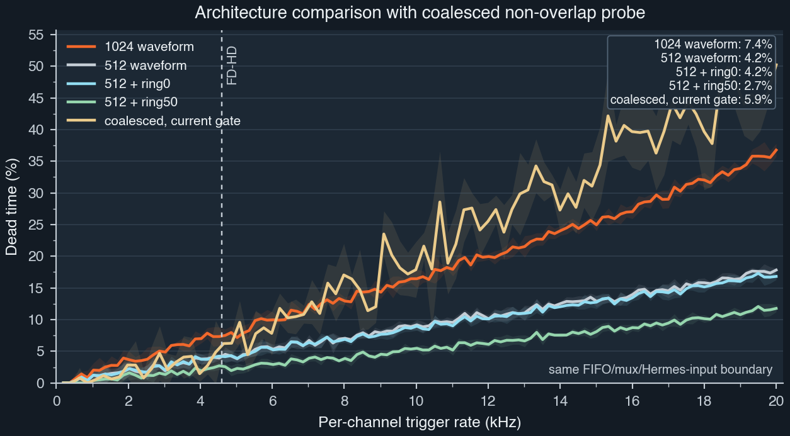
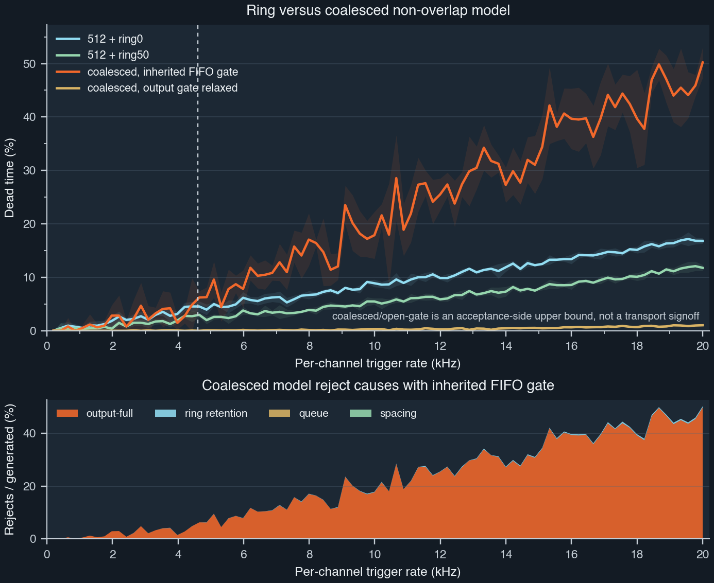
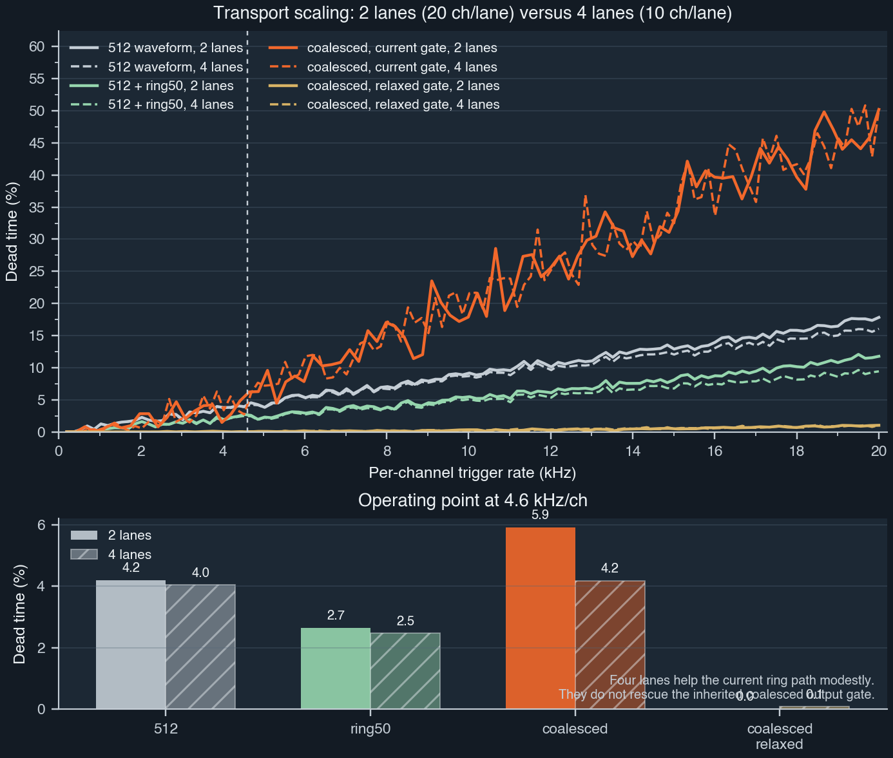
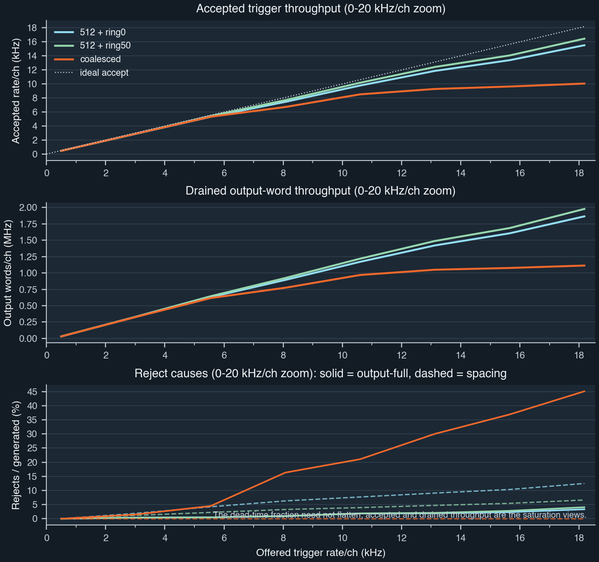

# Dead-Time Optimization Study

## Problem

The current dead-time discussion has moved past the basic `1024 -> 512` frame
reduction.

The open design question is now:

- if waveform overlap is forbidden,
- what architecture gives the next meaningful dead-time reduction,
- and is it better to spend effort on packet/assembler semantics, BRAM release,
  or transport splitting?

This note answers that with the stochastic C++ model in
[`src/ring_deadtime_sim.cpp`](../src/ring_deadtime_sim.cpp).

## Studied cases

The dense sweeps cover:

- `1024 waveform`
- `512 waveform`
- `512 + ring0`
- `512 + ring50`
- `coalesced, current gate`
- `coalesced, relaxed gate`

Transport scaling is then evaluated separately with:

- `2 lanes`, `20` channels per lane
- `4 lanes`, `10` channels per lane

The `coalesced` model is the non-overlap candidate. It accepts triggers
independently of waveform interval boundaries and then:

- absorbs triggers already covered by the existing interval,
- extends the tail interval if the next trigger overlaps its end,
- or starts a new non-overlapping interval clipped to the already covered
  sample range.

So the `coalesced` architecture is the software-model version of:

- merge rings with the packet assembler,
- keep waveform intervals non-overlapping,
- and let packet assembly follow interval coverage rather than one-trigger /
  one-frame semantics.

## Main figures

### Architecture comparison



### Coalesced versus ring



### Transport scaling



### Throughput view



## Anchor values

Dense sweep anchors, interpolated at representative operating points:

| case | `4.6 kHz/ch` | `10 kHz/ch` | `14 kHz/ch` | `20 kHz/ch` |
|---|---:|---:|---:|---:|
| `1024 waveform` | `7.41%` | `16.46%` | `24.02%` | `36.76%` |
| `512 waveform` | `4.20%` | `9.14%` | `12.52%` | `17.83%` |
| `512 + ring0` | `4.20%` | `8.94%` | `12.03%` | `16.82%` |
| `512 + ring50` | `2.65%` | `5.47%` | `7.55%` | `11.77%` |
| `coalesced, current gate` | `5.92%` | `18.06%` | `27.37%` | `50.22%` |
| `coalesced, relaxed gate` | `0.01%` | `0.33%` | `0.46%` | `1.03%` |

High-stat spot checks (`20` repeats) at the same key rates confirm the same
ranking:

| case | `4.6 kHz/ch` | `10 kHz/ch` | `14 kHz/ch` | `20 kHz/ch` |
|---|---:|---:|---:|---:|
| `512 + ring50` | `2.36%` | `5.14%` | `7.60%` | `11.92%` |
| `512 + ring50`, `4 lanes` | `2.23%` | `4.69%` | `6.65%` | `9.47%` |
| `coalesced, current gate` | `5.46%` | `20.29%` | `31.66%` | `48.55%` |
| `coalesced, current gate`, `4 lanes` | `5.46%` | `20.10%` | `31.85%` | `48.45%` |

Spot CSVs:

- [`spot_ring50_2lane.csv`](../data/output/analysis/spot_ring50_2lane.csv)
- [`spot_ring50_4lane.csv`](../data/output/analysis/spot_ring50_4lane.csv)
- [`spot_coalesced_2lane.csv`](../data/output/analysis/spot_coalesced_2lane.csv)
- [`spot_coalesced_4lane.csv`](../data/output/analysis/spot_coalesced_4lane.csv)

## What the model says

### 1. The current best practical curve is still `512 + ring50`

If the current downstream contracts are left alone, the best curve in the
`0.2–20 kHz/ch` study remains:

- `512 + ring50`

This improves materially over both `1024` and plain `512`:

- at `4.6 kHz/ch`: `7.41% -> 2.65%`
- at `10 kHz/ch`: `16.46% -> 5.47%`
- at `14 kHz/ch`: `24.02% -> 7.55%`
- at `20 kHz/ch`: `36.76% -> 11.77%`

### 2. The non-overlap coalesced idea is only good if the output gate changes

This is the most important result in the study.

The non-overlap `coalesced` model is **worse** than `ring50` under the current
per-channel output-full contract:

- `4.6 kHz/ch`: `5.92%`
- `10 kHz/ch`: `18.06%`
- `14 kHz/ch`: `27.37%`
- `20 kHz/ch`: `50.22%`

The reject-cause split explains why:

- spacing rejects vanish,
- queue rejects stay negligible,
- ring rejects remain tiny,
- and almost all loss becomes `output-full`.

At the key points:

| case | dead time | spacing | ring | queue | output-full |
|---|---:|---:|---:|---:|---:|
| `ring50 @ 4.6 kHz/ch` | `2.65%` | `2.17%` | `0.00%` | `0.00%` | `0.48%` |
| `ring50 @ 10 kHz/ch` | `5.47%` | `4.04%` | `0.00%` | `0.00%` | `1.41%` |
| `ring50 @ 14 kHz/ch` | `7.55%` | `5.15%` | `0.01%` | `0.00%` | `2.39%` |
| `coalesced @ 4.6 kHz/ch` | `5.92%` | `0.00%` | `0.01%` | `0.00%` | `5.94%` |
| `coalesced @ 10 kHz/ch` | `18.06%` | `0.00%` | `0.21%` | `0.00%` | `17.80%` |
| `coalesced @ 14 kHz/ch` | `27.37%` | `0.00%` | `0.28%` | `0.00%` | `27.16%` |

So the non-overlap algorithm is **not** the problem. The inherited output gate
is.

### 3. If the coalesced output gate is relaxed, the non-overlap concept becomes excellent

This is the acceptance-side upper bound:

- `coalesced, relaxed gate`

Its dense sweep stays near zero throughout the studied range:

- `4.6 kHz/ch`: `0.01%`
- `10 kHz/ch`: `0.33%`
- `14 kHz/ch`: `0.46%`
- `20 kHz/ch`: `1.03%`

That is the strongest argument in favor of a non-overlap packet/assembler
redesign:

- if the assembler can merge coverage and stop applying the current per-channel
  output-full rule,
- the acceptance-side dead time becomes almost negligible in the operating
  band of interest.

### 4. Four lanes are a second-order gain, not the primary solution

Splitting the current transport from:

- `2 lanes x 20 channels`

to:

- `4 lanes x 10 channels`

helps the current ring path, but only modestly:

| case | `4.6 kHz/ch` | `10 kHz/ch` | `14 kHz/ch` | `20 kHz/ch` |
|---|---:|---:|---:|---:|
| `512 waveform` | `4.20% -> 4.04%` | `9.14% -> 8.69%` | `12.52% -> 11.63%` | `17.83% -> 16.06%` |
| `512 + ring50` | `2.65% -> 2.47%` | `5.47% -> 5.07%` | `7.55% -> 6.60%` | `11.77% -> 9.43%` |

For the current coalesced model, four lanes do **not** help materially:

- `4.6 kHz/ch`: `5.46% -> 5.46%`
- `10 kHz/ch`: `20.29% -> 20.10%`
- `14 kHz/ch`: `31.66% -> 31.85%`
- `20 kHz/ch`: `48.55% -> 48.45%`

So:

- more links are useful,
- but they are not the main fix,
- and they do not rescue the current coalesced contract.

## RTL and implementation implications

### Counters are not the first thing to cut

The current gateware already moved the hot-path counters in
[`stc3_record_builder.vhd`](../../daphne-firmware/rtl/isolated/subsystems/trigger/stc3_record_builder.vhd)
to narrow live counters and reconstructs long totals upstream.

The register bank in
[`selftrigger_register_bank.vhd`](../../daphne-firmware/rtl/isolated/subsystems/control/selftrigger_register_bank.vhd)
already accumulates the long counters in block RAM-style arrays.

So the first-order resource problem is not “too many 64-bit counters.” It is:

- waveform storage,
- packet assembly / FIFO admission policy,
- debug/spy BRAM,
- and transport structure.

If needed later:

- keep detailed counters behind a synthesis generic,
- and explicitly keep wide diagnostic arithmetic off the hot path.

### Releasing BRAM is a credible lever

The current main tree explicitly documents major board-local BRAM consumers:

- [`spybuffers.vhd`](../../daphne-firmware/ip_repo/daphne_ip/rtl/spy/spybuffers.vhd)
  says the spy plane uses `49` BRAM36 at the current `2k` depth
- [`outspybuff.vhd`](../../daphne-firmware/ip_repo/daphne_ip/rtl/misc/outspybuff.vhd)
  says the output spy FIFO uses:
  - `2` BRAM36 at `1024`
  - `4` BRAM36 at `2048`
  - `8` BRAM36 at `4096`

That makes the spy plane the cleanest BRAM release valve for a production
variant.

### The current `ring-builder-2k` hardware baseline is real, but BRAM-limited

The latest successful Linux-native implementation run on `np04-srv-017` is:

- branch: `marroyav/ring-builder-2k`
- commit: `27a4ca9`
- artifacts produced:
  - `.bit`
  - `.bin`
  - `.xsa`
  - `.dtbo`

From the archived reports:

Post-synth:

- CLB LUTs: `107,963 / 117,120` (`92.18%`)
- LUT as Logic: `98,658 / 117,120` (`84.24%`)
- CLB Registers: `141,316 / 234,240` (`60.33%`)
- Block RAM Tile: `142 / 144` (`98.61%`)
- URAM: `40 / 64` (`62.50%`)
- DSPs: `1200 / 1248` (`96.15%`)

Post-route:

- CLB LUTs: `105,404 / 117,120` (`90.00%`)
- LUT as Logic: `97,547 / 117,120` (`83.29%`)
- CLB Registers: `138,538 / 234,240` (`59.14%`)
- Block RAM Tile: `139 / 144` (`96.53%`)
- URAM: `40 / 64` (`62.50%`)
- DSPs: `1200 / 1248` (`96.15%`)
- WNS: `+0.103 ns`
- TNS: `0.000`
- WHS: `+0.010`
- THS: `0.000`

This changes the practical optimization picture:

- the `2k` ring architecture is no longer speculative; it is buildable
- LUTs are high, but no longer the stopping condition
- BRAM is now the dominant implementation constraint
- DSP remains tight but is slightly better than the earlier `1240`-DSP builds

So the next hardware reduction effort should target BRAM first, not counters.

### Resource deltas now identify the real first lever

Against the earlier routed-clean `a389fcd` baseline, the current successful
`27a4ca9` ring build looks like this:

| build | CLB LUTs | LUT as Logic | BRAM tiles | URAM | DSPs | WNS |
|---|---:|---:|---:|---:|---:|---:|
| `a389fcd` baseline | `84,532` | `84k-class` | `99` | `40` | `1240` | `+0.247 ns` |
| `27a4ca9` ring2k | `105,404` | `97,547` | `139` | `40` | `1200` | `+0.103 ns` |
| delta | `+20,872` | `+13k-class` | `+40` | `0` | `-40` | `-0.144 ns` |

This is the most useful budgeting fact in the study:

- the ring2k path is not failing on timing,
- it is not failing on DSP,
- and its incremental cost is now dominated by about `+40` BRAM tiles.

That aligns closely with the ring-storage expectation and means the next
resource argument should be made in BRAM, not in abstract LUT terms.

### BRAM release is more concrete than “general optimization”

The main tree already exposes a BRAM budget large enough to matter:

- the spy-capture plane is documented in
  [`spybuffers.vhd`](../../daphne-firmware/ip_repo/daphne_ip/rtl/spy/spybuffers.vhd)
  as `49` BRAM36 at the current `2k` depth
- the output spy FIFO is documented in
  [`outspybuff.vhd`](../../daphne-firmware/ip_repo/daphne_ip/rtl/misc/outspybuff.vhd)
  as `4` BRAM36 at `2048`

So the first realistic “make room for a better assembler” option is not an
uncertain micro-optimization. It is:

- keep the proven `2k` ring baseline,
- create an optimized build flavor that drops or shrinks the spy path,
- and reclaim on the order of the entire current ring cost in BRAM.

That is a much stronger position than trying to save a few BRAMs indirectly by
rewriting counters or transport mux bookkeeping.

### The logs do not show accidental dead logic; they show deliberate feature load

There is no evidence in the current successful reports of a giant block of
accidentally unused logic waiting to be swept away.

What the logs do show is:

- explicit BRAM-heavy debug/instrumentation features in the source tree
- methodology warnings clustered mostly in the transport / Ethernet side
- a routed build that is resource-tight but valid

So the practical removable logic is:

- optional spy/debug capture,
- not some hidden dead datapath inside the self-trigger core.

That distinction matters, because it means the next cut should be made by
feature composition, not by speculative “cleanup” edits in already-routed
trigger logic.

### Methodology warnings point mostly away from the ring builder

From the successful `27a4ca9` reports:

- post-route methodology shows `TIMING-17`, `TIMING-6`, `TIMING-7`,
  `LUTAR-1`, `NTCN-11`, and `ULMTCS-1`
- post-implementation DRC shows `DPIP-2`, `DPOP-3`, and `DPOP-4`
- post-route utilization shows `Unique Control Sets = 4240` (`14.48%`)

The detailed critical-warning population is dominated by the transport /
Ethernet side, not by the ring-builder acceptance path.

That does **not** mean the transport should be ignored. It means:

- the current self-trigger ring path is already good enough to route,
- while some of the remaining QoR cleanup is in shared board/transport logic,
- and therefore transport cleanup should be treated as a follow-on QoR task,
  not as the first dead-time lever.

### Modular build structure supports BRAM-trimmed variants

The composable build is already structured around explicit feature planes:

- [`daphne-composable.core`](../../daphne-firmware/cores/features/daphne-composable.core)
- [`k26c-board-shell.core`](../../daphne-firmware/cores/features/k26c-board-shell.core)
- [`k26c-board-transport-plane.core`](../../daphne-firmware/cores/features/k26c-board-transport-plane.core)

The current board shell still pulls in the spy-capture plane directly, so a
production “optimized readout” flavor would still need a small top/core split.

But the decomposition already exists:

- frontend plane
- timing plane
- selftrigger plane
- transport plane
- spy capture plane

That means the best BRAM-saving build flavor is not a deep RTL rewrite. It is a
clean alternate shell/platform composition that drops or shrinks the spy path.

### UltraFast guidance lines up with the same priorities

The AMD references used for this study are catalogued locally in:

- `/Users/marroyav/library/amd-docs/README.md`

The most relevant recommendations are:

- reduce unnecessary control sets and resets
- use `report_qor_suggestions`, `report_design_analysis`, and
  `report_methodology` early
- treat high-fanout nets and congestion explicitly, instead of relying on blind
  global replication
- move deep shift-style storage into block RAM where that mapping is structurally
  correct
- use `RAM_STYLE` / block-RAM output registers intentionally
- avoid spending scarce DSP budget on logic that does not need it

Those recommendations come directly from UG949/UG901/UG912 and are consistent
with what the current firmware tree already exposes as likely levers.

The K26 device limits in DS987 are also now part of the argument, not just
background context:

- CLB LUTs: `117,120`
- BRAM36-equivalent tiles: `144`
- URAM blocks: `64`
- DSP slices: `1,248`

With the current successful ring2k route at `139 / 144` BRAM tiles, the design
is telling us very clearly which budget is gone first.

## Recommended implementation order

### 1. Keep waveform overlap off in the long-term architecture

That matches the physics/DAQ requirement and the simulation result says the
non-overlap direction is still viable.

### 2. Preserve `27a4ca9` as the hardware baseline

Do not destabilize the current successful `ring-builder-2k` route while
exploring the next architecture.

This build is the current proof that:

- the ring2k concept fits,
- timing is positive,
- and the next trade study can be anchored to a real implementation.

### 3. Build a BRAM-trimmed production flavor before redesigning the assembler

The first hardware branch after `27a4ca9` should be a build flavor that:

- removes or shrinks spy capture,
- keeps the routed self-trigger/ring path intact,
- and measures how much BRAM headroom is actually recovered.

That is the most direct way to buy space for the next packet/assembler contract.

### 4. Prototype a coalesced non-overlap assembler in simulation first

Target behavior:

- one active coverage interval per channel
- any trigger fully inside the current interval is metadata only
- any trigger that extends the tail grows the same interval
- the next interval starts immediately after the previous covered sample, not
  at a fresh overlapping window

That is the right semantics for:

- no overlapping waveform payload,
- minimal acceptance dead time.

### 5. Change the downstream contract before spending effort on more links

The current coalesced model fails because of inherited `prog_full`, not because
the algorithm is bad.

So the next hardware work should be one of:

- a different assembler admission metric based on actual queued output words,
- a board-level packet assembler that owns interval coalescing and only exposes
  completed variable-length records to the transport,
- or a widened transport-side buffer contract that no longer blocks the channel
  at the current threshold.

### 6. Treat four lanes as a follow-on improvement

Four lanes help the current ring path, but they are not the main fix.

So:

- do not lead with transport splitting,
- use it later as an incremental gain once the assembler contract is corrected.

### 7. Use UltraFast-style reporting as part of the branch workflow

The current successful run did not archive everything we would want for the next
decision round.

The next build automation pass should preserve:

- hierarchical utilization
- `report_design_analysis`
- `report_qor_suggestions`
- checkpoints suitable for post-route follow-up reports

That is process work, but it is useful process work because the next decision is
about where to spend recovered BRAM, not whether the branch can route at all.

## Current blocker

This note now integrates the latest successful remote implementation reports.

Top-level fit is no longer the blocker.

The next blocker is architectural:

- the best no-overlap algorithm requires a different packet/assembler contract,
- and the hardware cost of that contract will have to come primarily from BRAM
  reclaimed elsewhere.

The most useful next reports from the successful `27a4ca9` build are:

- hierarchical BRAM utilization
- hierarchical LUT utilization
- QoR suggestions / methodology reports for congestion and control sets

Those will let the implementation plan assign savings to:

- spy plane
- record-builder path
- transport plane
- any residual distributed-memory or control-set hotspots

## Reproduction

Run the full dense study bundle:

```sh
python3 scripts/run_deadtime_optimization_study.py
```

Run the high-stat spot checks used in the transport table:

```sh
./ring_deadtime_sim --architecture ring --signal-delay-steps 16 \
  --rate-list 4600,10000,14000,20000 --repeats 20 \
  --warmup-cycles 20000 --measure-cycles 200000 \
  --csv-out data/output/analysis/spot_ring50_2lane.csv

./ring_deadtime_sim --architecture ring --signal-delay-steps 16 \
  --lanes 4 --channels-per-lane 10 \
  --rate-list 4600,10000,14000,20000 --repeats 20 \
  --warmup-cycles 20000 --measure-cycles 200000 \
  --csv-out data/output/analysis/spot_ring50_4lane.csv

./ring_deadtime_sim --architecture coalesced \
  --rate-list 4600,10000,14000,20000 --repeats 20 \
  --warmup-cycles 20000 --measure-cycles 200000 \
  --csv-out data/output/analysis/spot_coalesced_2lane.csv

./ring_deadtime_sim --architecture coalesced \
  --lanes 4 --channels-per-lane 10 \
  --rate-list 4600,10000,14000,20000 --repeats 20 \
  --warmup-cycles 20000 --measure-cycles 200000 \
  --csv-out data/output/analysis/spot_coalesced_4lane.csv
```
