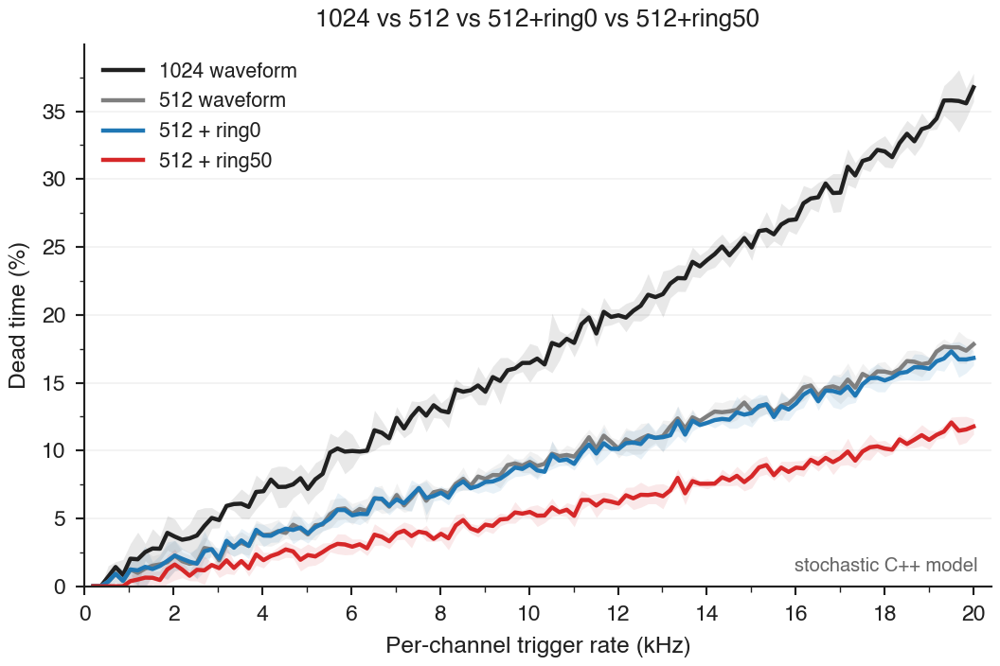

# Four-Way Dead-Time Architecture Study

## Problem

The design question is not just whether the ring builder helps, but how much of
the dead-time reduction comes from each architectural step:

1. shorten the waveform from `1024` to `512` samples
2. keep `512` but move to the queued ring builder with `0%` overlap
3. keep `512` and allow `50%` overlap on the ring builder

The comparison documented here is therefore:

- `1024 waveform`
- `512 waveform`
- `512 + ring0`
- `512 + ring50`

across the full spectrum from a few hundred Hz/channel up to `20 kHz/channel`.

## Scope

This study uses the new stochastic C++ dead-time model:

- [`src/ring_deadtime_sim.cpp`](../src/ring_deadtime_sim.cpp)

It is not an HDL plot.

That choice is intentional:

- the C++ model is fast enough to generate dense curves over the full spectrum
- it exposes the same reject categories as the ring HDL bench
- it lets us compare multiple architectural variants on one consistent footing

This is the right tool for broad tradeoff exploration.

It is **not** the final signoff tool. The HDL bench is still the reference for
spot validation.

## Compared Architectures

### `1024 waveform`

This is the legacy fixed-builder style with:

- frame length = `1024`
- fixed busy interval = `1037` cycles
- record length = `232` words
- per-channel output FIFO thresholds unchanged:
  - `prog_empty = 220`
  - `prog_full = 200`

This is represented in the C++ model with:

- `--architecture legacy`
- `--frame-samples 1024`
- `--record-words 232`
- `--builder-busy-cycles 1037`

### `512 waveform`

This is the no-ring `512` checkpoint, still using the legacy one-frame-at-a-time
acceptance model:

- frame length = `512`
- fixed busy interval = `525` cycles
- record length = `120` words
- FIFO thresholds still inherited from the existing builder path:
  - `prog_empty = 220`
  - `prog_full = 200`

Important nuance:

- this is **not** an idealized “half the dead time by definition” case
- the FIFO thresholds were not re-optimized for the shorter `120`-word frame
- so the plain `512` curve includes that real self-throttling behavior

This is represented in the C++ model with:

- `--architecture legacy`
- `--frame-samples 512`
- `--record-words 120`
- `--builder-busy-cycles 525`

### `512 + ring0`

This matches the ring-builder candidate architecture under study with:

- frame length = `512`
- ring depth = `2048`
- queue depth = `4`
- overlap = `0`
- output FIFO thresholds:
  - `prog_empty = 220`
  - `prog_full = 200`

Acceptance is gated by the same classes as the HDL ring builder:

- spacing
- queue capacity
- ring safety
- output-full

### `512 + ring50`

This is the same `2048`-deep ring builder with:

- `50%` waveform overlap
- current RTL encoding: `signal_delay_steps = 16`
- overlap = `256` samples for a `512`-sample frame

It keeps the same queue and output path as `ring0`, so the only intended change
is the spacing policy.

## Model Semantics

The stochastic model is event-driven and channel-homogeneous.

It models:

- per-channel stochastic trigger arrivals
- per-channel builder acceptance/reject logic
- queueing of pending frames for the ring builder
- serializer completion at record granularity
- shared lane service with the same scan/dump/pause structure as the mux model
- FIFO visibility via:
  - `prog_empty`
  - `prog_full`

It also reports the same high-level counters used in the HDL studies:

- `busy_counter_total`
- `full_counter_total`
- `spacing_counter_total`
- `queue_counter_total`
- `ring_counter_total`
- `output_counter_total`

What it does **not** model in full detail:

- per-word serializer-to-FIFO timing inside a frame
- waveform content
- descriptor/trailer semantics
- trigger-shape dependence
- cross-channel physical correlation

So this is a dead-time architecture model, not a waveform physics model.

## Commands

Run the full comparison:

```sh
python3 scripts/run_deadtime_fourway_compare.py
```

Default scan:

- `200 Hz/ch` to `20 kHz/ch`
- `120` points
- `4` repeats
- `20000` warmup cycles
- `200000` measurement cycles

Generated outputs:

- [`deadtime_arch_1024_cpp.csv`](../data/output/analysis/deadtime_arch_1024_cpp.csv)
- [`deadtime_arch_512_cpp.csv`](../data/output/analysis/deadtime_arch_512_cpp.csv)
- [`deadtime_arch_512_ring0_cpp.csv`](../data/output/analysis/deadtime_arch_512_ring0_cpp.csv)
- [`deadtime_arch_512_ring50_cpp.csv`](../data/output/analysis/deadtime_arch_512_ring50_cpp.csv)
- [`deadtime_arch_fourway_cpp.png`](../data/output/plots/deadtime_arch_fourway_cpp.png)
- [`deadtime_arch_fourway_cpp.pdf`](../data/output/plots/deadtime_arch_fourway_cpp.pdf)
- [`deadtime_arch_fourway_cpp.svg`](../data/output/plots/deadtime_arch_fourway_cpp.svg)

## Figure



## Anchor Table

Representative points from the dense sweep:

| rate [Hz/ch] | `1024 waveform` [%] | `512 waveform` [%] | `512 + ring0` [%] | `512 + ring50` [%] |
|---:|---:|---:|---:|---:|
| `1032`  | `2.03` | `1.24` | `1.24` | `0.38` |
| `4600`  | `7.41` | `4.20` | `4.20` | `2.65` |
| `5025`  | `7.17` | `3.82` | `3.90` | `2.30` |
| `10017` | `16.46` | `9.16` | `8.97` | `5.48` |
| `14010` | `24.05` | `12.54` | `12.04` | `7.55` |
| `20000` | `36.76` | `17.83` | `16.82` | `11.77` |

## Findings

### 1. The dominant gain is still `1024 -> 512`

That is the first major reduction across the full rate range.

Examples:

- around `10 kHz/ch`: `16.46% -> 9.16%`
- around `14 kHz/ch`: `24.05% -> 12.54%`
- at `20 kHz/ch`: `36.76% -> 17.83%`

So the waveform-length reduction is still the biggest single lever.

### 2. `512 + ring0` is at best a modest improvement over plain `512`

That is expected.

With zero overlap, the ring builder removes some structural inefficiency, but it
does not fundamentally relax the spacing policy.

Examples:

- at the FD-HD point around `4.6 kHz/ch`: `4.20% -> 4.20%`
- around `5 kHz/ch`: `3.82% -> 3.90%`
- around `10 kHz/ch`: `9.16% -> 8.97%`
- around `14 kHz/ch`: `12.54% -> 12.04%`
- at `20 kHz/ch`: `17.83% -> 16.82%`

So `ring0` is essentially neutral at the FD-HD point and only becomes a modest
improvement as the rate rises. It does not change the regime dramatically.

### 3. `512 + ring50` is the strongest architecture of the four

This is the first case that gives a materially different curve beyond the
`512` reduction alone.

Examples:

- around `10 kHz/ch`: `5.48%`
- around `14 kHz/ch`: `7.55%`
- at `20 kHz/ch`: `11.57%`

Relative to the original `1024` waveform:

- around `10 kHz/ch`: `16.46% -> 5.48%`
- around `14 kHz/ch`: `24.05% -> 7.55%`
- at `20 kHz/ch`: `36.76% -> 11.77%`

That is the architecture that actually changes the operating envelope.

### 4. The four-way comparison clarifies the real story

The correct interpretation is not:

- “ring buffers alone solve dead time”

It is:

- shortening the waveform is the first big gain
- ring buffering with no overlap adds only a smaller improvement
- overlap is the feature that makes the ring architecture materially better

That is exactly why the four-way plot is useful.

## Current Limitations

This note is intentionally explicit about what is still missing.

### This is not yet an HDL four-way plot

The dense four-way figure is from the stochastic C++ model.

The HDL bench already supports:

- baseline
- ring0
- ring50

But the dense all-spectrum comparison is currently easiest and cheapest in the
C++ model.

### The plain `512` case is architecture-realistic, not idealized

Because the no-ring `512` checkpoint kept:

- `prog_empty = 220`
- `prog_full = 200`

with only a `120`-word frame, it does not behave like a clean “half-size frame”
ideal limit. That is correct for this comparison, but it is important context.

### The C++ model still needs HDL cross-checks

The next validation step is not another dense sweep. It is:

- select sparse rate points
- run HDL where available
- overlay them on the same architecture plot

That will tell us where the stochastic approximation is still too optimistic or
too pessimistic.

## Conclusion

The four-way result is coherent:

- `1024 -> 512` gives the first big dead-time reduction
- `512 + ring0` is a small incremental improvement
- `512 + ring50` is the first architecture that produces a strong additional
  reduction on top of the shorter frame

So if the goal is a meaningful all-spectrum dead-time improvement, the most
promising architecture among the four is:

- `512 + ring50`

And if the question is where the value comes from:

- first from `512`
- then from overlap
- only marginally from `ring0` by itself
