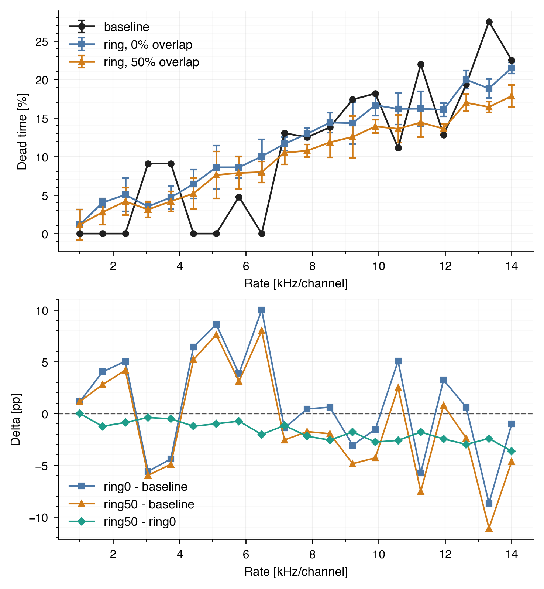
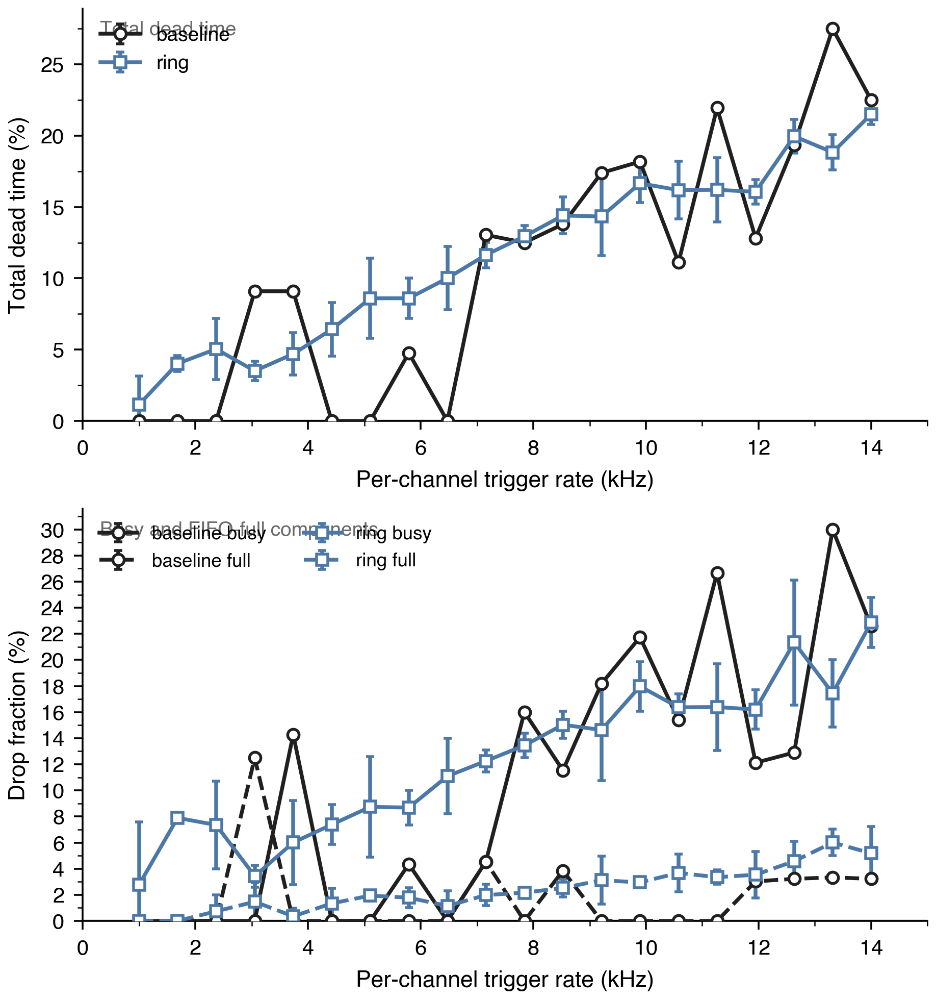
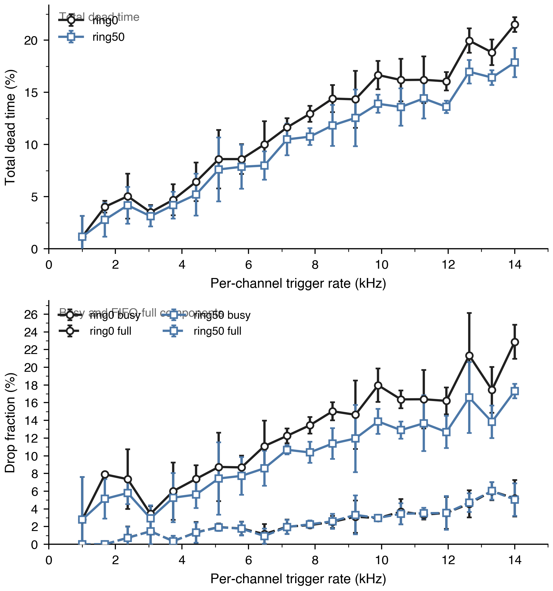
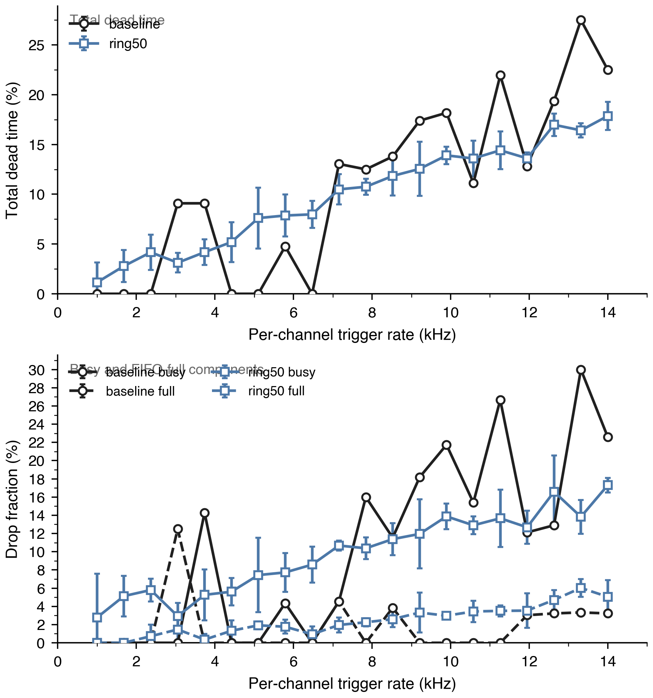

# Ring Builder Dead-Time Study

## Problem

The question is whether the experimental `1k` BRAM-backed ring-buffer builder
reduces per-channel dead time relative to the baseline builder, and whether
allowing controlled waveform overlap improves the result further.

The study compares three HDL configurations:

- `baseline`: current non-ring builder reference
- `ring0`: ring builder with `0%` overlap
- `ring50`: ring builder with `50%` overlap

For the ring builder, `50%` overlap means:

- frame length = `512` samples
- overlap = `256` samples
- RTL control = `signal_delay_i = 16`

## Important bench notes

Two ring-specific details matter for correct interpretation:

1. The ring builder accepts a trigger before it serializes the frame.
   The bench therefore measures accepted events with `packet_count_o`, not
   `record_count_o`.
2. The ring builder now instantiates `xpm_memory_sdpram` explicitly.
   The local GHDL path uses a bench-local behavioral XPM shim so the dead-time
   study can run without Vivado simulation libraries.

This means the `ring0` and `ring50` runs are directly comparable to each other.
The `baseline` reference used here is the existing `20`-point HDL summary in
`data/output/analysis/deadtime_hdl_fixed_20pt.csv`, so a future rerun of the
baseline with the updated bench conventions would still be worthwhile.

## Method

Common run settings:

- channels = `40`
- lanes = `2`
- warmup cycles = `10000`
- measurement cycles = `50000`
- rate grid = `20` points from `1 kHz/ch` to `14 kHz/ch`
- repeats:
  - baseline reference = existing summary file
  - ring runs = `3`

Data sources:

- baseline: [deadtime_hdl_fixed_20pt.csv](../data/output/analysis/deadtime_hdl_fixed_20pt.csv)
- ring0: [deadtime_hdl_ring_20pt.csv](../data/output/analysis/deadtime_hdl_ring_20pt.csv)
- ring50: [deadtime_hdl_ring50_20pt.csv](../data/output/analysis/deadtime_hdl_ring50_20pt.csv)
- three-way merged table: [deadtime_threeway_compare_20pt.csv](../data/output/analysis/deadtime_threeway_compare_20pt.csv)

## Figures

Three-way comparison:



Baseline vs `0%` overlap:



Ring `0%` vs `50%` overlap:



Baseline vs `50%` overlap:



## High-rate comparison

This is the most relevant operating region for the `>10 kHz/ch` target.

| rate [kHz/ch] | baseline [%] | ring0 [%] | ring50 [%] | ring0-baseline [pp] | ring50-baseline [pp] | ring50-ring0 [pp] |
|---:|---:|---:|---:|---:|---:|---:|
| 9.895 | 18.18 | 16.66 | 13.90 | -1.52 | -4.28 | -2.76 |
| 10.579 | 11.11 | 16.18 | 13.59 | 5.07 | 2.48 | -2.59 |
| 11.263 | 21.95 | 16.21 | 14.42 | -5.75 | -7.53 | -1.79 |
| 11.947 | 12.82 | 16.06 | 13.61 | 3.24 | 0.79 | -2.45 |
| 12.632 | 19.35 | 19.96 | 16.98 | 0.61 | -2.37 | -2.98 |
| 13.316 | 27.50 | 18.83 | 16.42 | -8.67 | -11.08 | -2.41 |
| 14.000 | 22.50 | 21.50 | 17.86 | -1.00 | -4.64 | -3.64 |

## Findings

- `ring0` is not uniformly better than the baseline reference.
  It improves some points, but it also regresses others.
- `ring50` is consistently better than `ring0` in the `10–14 kHz/ch` region.
  In this study the overlap benefit is about `1.8–3.6` dead-time points.
- At the high end, `ring50` is usually better than the baseline reference.
  The strongest improvement in this set is at `13.316 kHz/ch`, where the dead
  time moves from `27.50%` to `16.42%`.
- The gain from overlap comes mostly from reducing the busy component.
  The full/transport component remains present and does not disappear with the
  overlap policy.

## Reproduction

Run the zero-overlap ring sweep:

```sh
python3 scripts/run_multichannel_deadtime_tb.py \
  --firmware-root ../daphne-firmware-bram \
  --rate-start 1000 \
  --rate-stop 14000 \
  --points 20 \
  --repeats 3 \
  --jobs 6 \
  --warmup-cycles 10000 \
  --measure-cycles 50000 \
  --csv-out data/output/analysis/deadtime_hdl_ring_20pt.csv \
  --raw-csv-out data/output/analysis/deadtime_hdl_ring_20pt_raw.csv
```

Run the `50%` overlap sweep:

```sh
python3 scripts/run_multichannel_deadtime_tb.py \
  --firmware-root ../daphne-firmware-bram \
  --signal-delay-steps 16 \
  --rate-start 1000 \
  --rate-stop 14000 \
  --points 20 \
  --repeats 3 \
  --jobs 6 \
  --warmup-cycles 10000 \
  --measure-cycles 50000 \
  --csv-out data/output/analysis/deadtime_hdl_ring50_20pt.csv \
  --raw-csv-out data/output/analysis/deadtime_hdl_ring50_20pt_raw.csv
```

Render the three-way comparison:

```sh
python3 scripts/plot_deadtime_threeway_compare.py \
  --baseline-csv data/output/analysis/deadtime_hdl_fixed_20pt.csv \
  --ring0-csv data/output/analysis/deadtime_hdl_ring_20pt.csv \
  --ring50-csv data/output/analysis/deadtime_hdl_ring50_20pt.csv \
  --out-prefix data/output/plots/deadtime_threeway_compare_20pt \
  --csv-out data/output/analysis/deadtime_threeway_compare_20pt.csv
```
